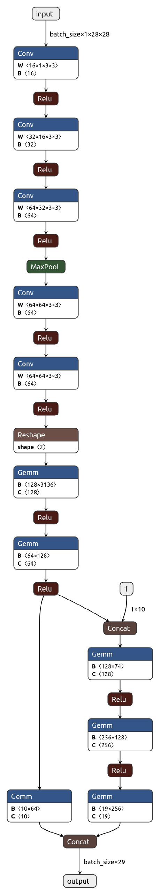

# Session 3 - PyTorch


| <centre>Name</centre> | <centre>Mail id</centre> | 
| ------------ | ------------- |
| <centre>Amit Agarwal</centre>         | <centre>amit.pinaki@gmail.com</centre>    |
| <centre>Pranav Panday</centre>         | <centre>pranavpandey2511@gmail.com</centre>    |
| <centre>Rajamannar A K</centre>         | <centre>rajamannaraanjaram@gmail.com</centre>    |
| <centre>Sree Latha Chopparapu</centre>         | <centre>sreelathaemail@gmail.com</centre>    |


<!-- toc -->

### Problem Statement

> Create a Neural Network that takes two inputs one from MNIST and another would be a random number. There are two output for this Neural Network, one would the MNIST
prediction and another would be the addition of MNIST and random number.
<!-- toc -->
### Inputs :
1. Image from MNIST
2. Random Integer between 0-9
<!-- toc -->
### Outputs :

1. MNIST label for the image
2. Addition of MNIST Digit & Random Number

<p align="center">
  
</p>
<p align="center">
  <sup>*the second output neuron should be 12</sup>
<p>


<!-- toc -->
### DATA REPRESENTATION :
1. **Input 1** is an image(28x28) of a digit ranging from (0-9), which we procured from ***`MNIST`*** database.
2. **Input 2** is a random positive integer ranging from (0-9), represented in ***`one-hot encoded`*** format.


<!-- toc -->
### DATA GENERATION STRTEGY :
1. The data used for model is downloaded from MNIST database. This data further randomly split using ***torch.utils*** `randomm_split` function.
2. Data used for training and validation is split into `80:20 ratio`.
3. The other input is a `random number` generated by pre-defined Pytorch library functions `torch.randint`.
4. The random numbers are not generated with test and train set as they are limited no.of inputs, also eliminates the purpose of downloading.

<!-- toc -->
### METHOD OF COMBINING TWO INPUTS :
1. Few convolution layers and linear transformation is applied on the first input image, which resulted in a 1x64 vector.
2. the other input is a one-hot encoded vector of dimension  1x10. This one-hot encoded vector and mnist embeddings are combined by concatenation.

  . Model Training is performed on GPU by `model.to(device)`
  
 <!-- toc -->
 ### EVALUATION OF RESULTS :
From the data generated, 20% of the data is used for evaluation. During the training we fed a batch of data for several epochs to calculate the loss and accuracy for every epoch. 
  
 <!-- toc -->
 ### PREDICTION ANALYSIS :
1. The output of model is a vector of size 1x29, in which the first 10 values is used to predict mnist image digit. 
2. The prediction is done using argmax operation which is further compared with the ground truth that results in a binary vector.
3. The following 19 values(next values from the model output) are used to find out the addition result of both the inputs, by performing an argmax operation.
4. This result is further compared with ground truth to get a binary vector.

```A logical AND operation is done on these two final binary vectors for making the final prediction.```
  
<1-- toc -->
### LOSS FUNCTION AND STRATEGY :
1. Log-softmax is calculated on the predicted value and the loss is calculated using used negative log-likelihood strategy.
2. In most of the classification problems we use Negative log-likelihood as a loss function.
3. It will give high penalty for the wrong prediction estimations which helps to reach the global-minima swiftly.


<ins>```training logs```</ins>


~~~~
Epoch:0	 TRAIN	 Correct Prediction:30106/48000 	 Loss:489.8511267565191
Epoch:0	 VAL	 Correct Prediction:11572/12000 	 Loss:17.24329100549221

====================
Epoch:1	 TRAIN	 Correct Prediction:46999/48000 	 Loss:52.36955614387989
Epoch:1	 VAL	 Correct Prediction:11687/12000 	 Loss:10.387892739847302

====================
Epoch:2	 TRAIN	 Correct Prediction:47372/48000 	 Loss:32.09655133262277
Epoch:2	 VAL	 Correct Prediction:11742/12000 	 Loss:7.891992194578052

====================
Epoch:3	 TRAIN	 Correct Prediction:47446/48000 	 Loss:26.006397395394742
Epoch:3	 VAL	 Correct Prediction:11738/12000 	 Loss:9.153558249818161

====================
Epoch:4	 TRAIN	 Correct Prediction:47532/48000 	 Loss:22.361036259215325
Epoch:4	 VAL	 Correct Prediction:11725/12000 	 Loss:9.842007659375668

====================
Epoch:5	 TRAIN	 Correct Prediction:47574/48000 	 Loss:19.261629713349976
Epoch:5	 VAL	 Correct Prediction:11786/12000 	 Loss:7.376086459029466

====================
Epoch:6	 TRAIN	 Correct Prediction:47655/48000 	 Loss:16.18299133097753
Epoch:6	 VAL	 Correct Prediction:11700/12000 	 Loss:11.80275383265689

====================
Epoch:7	 TRAIN	 Correct Prediction:47641/48000 	 Loss:16.59774077660404
Epoch:7	 VAL	 Correct Prediction:11742/12000 	 Loss:9.120920339366421

====================
Epoch:8	 TRAIN	 Correct Prediction:47720/48000 	 Loss:12.451384601474274
Epoch:8	 VAL	 Correct Prediction:11734/12000 	 Loss:9.93087122682482

====================
Epoch:9	 TRAIN	 Correct Prediction:47709/48000 	 Loss:13.666506580077112
Epoch:9	 VAL	 Correct Prediction:11759/12000 	 Loss:8.874092090525664

====================
Epoch:10	 TRAIN	 Correct Prediction:47737/48000 	 Loss:12.82384952067514
Epoch:10	 VAL	 Correct Prediction:11789/12000 	 Loss:7.278427062265109

====================
Epoch:11	 TRAIN	 Correct Prediction:47765/48000 	 Loss:11.257602699712152
Epoch:11	 VAL	 Correct Prediction:11750/12000 	 Loss:10.062924214173108

====================
Epoch:12	 TRAIN	 Correct Prediction:47763/48000 	 Loss:11.245582903153263
Epoch:12	 VAL	 Correct Prediction:11752/12000 	 Loss:10.372109373478452

====================
Epoch:13	 TRAIN	 Correct Prediction:47805/48000 	 Loss:8.825875586248003
Epoch:13	 VAL	 Correct Prediction:11740/12000 	 Loss:12.250784480187576

====================
Epoch:14	 TRAIN	 Correct Prediction:47807/48000 	 Loss:9.59931086517463
Epoch:14	 VAL	 Correct Prediction:11775/12000 	 Loss:9.241124497028068

====================
Epoch:15	 TRAIN	 Correct Prediction:47790/48000 	 Loss:9.904423067448079
Epoch:15	 VAL	 Correct Prediction:11711/12000 	 Loss:13.126361697213724

====================
Epoch:16	 TRAIN	 Correct Prediction:47792/48000 	 Loss:9.877323295615497
Epoch:16	 VAL	 Correct Prediction:11774/12000 	 Loss:8.382123734336346

====================
Epoch:17	 TRAIN	 Correct Prediction:47873/48000 	 Loss:6.485747237558826
Epoch:17	 VAL	 Correct Prediction:11775/12000 	 Loss:10.01646953157615

====================
Epoch:18	 TRAIN	 Correct Prediction:47832/48000 	 Loss:7.892552048229845
Epoch:18	 VAL	 Correct Prediction:11767/12000 	 Loss:9.454519598046318

====================
Epoch:19	 TRAIN	 Correct Prediction:47885/48000 	 Loss:5.139216966999811
Epoch:19	 VAL	 Correct Prediction:11770/12000 	 Loss:10.073364923009649

====================
Training Accuracy: 99.62%
Validation Accuracy: 98.11%
~~~~
  
 ```Attaching a simple image representation of the model```
 
<p align="center">
  <sup>*The term Gemm means <ins>General matrix multiply</ins></sup>
<p>  
<p align="center">
  
</p>

  
  
  
  
  
  
  
  
